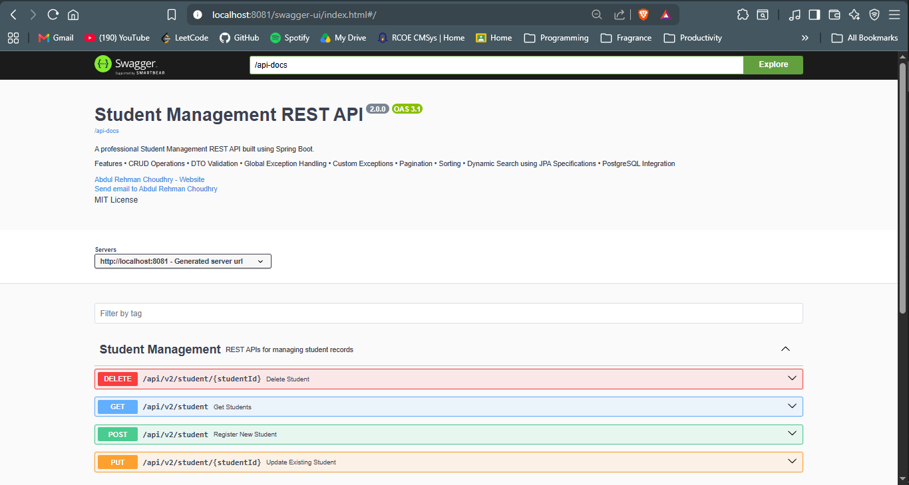
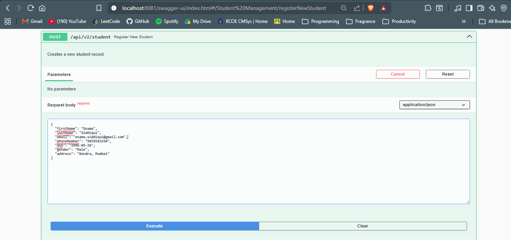
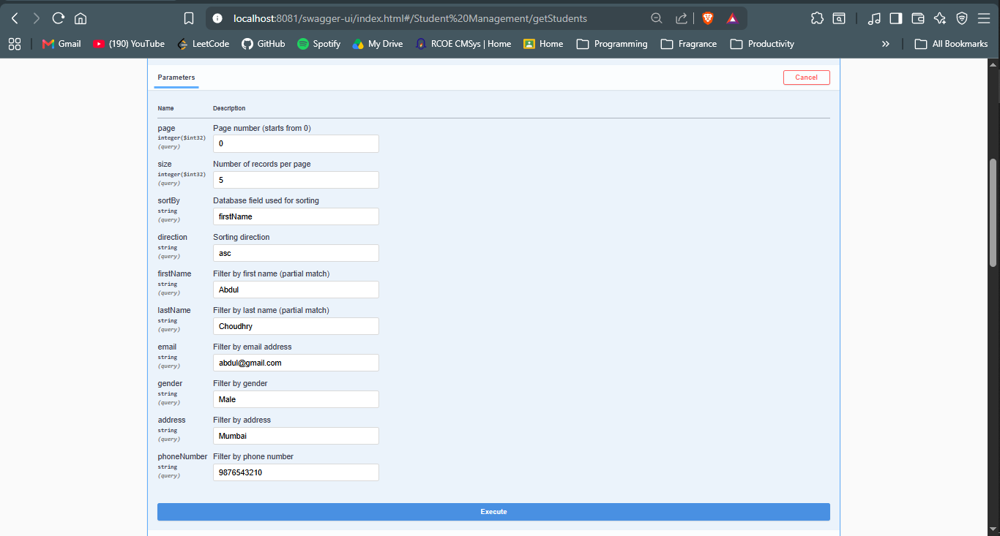
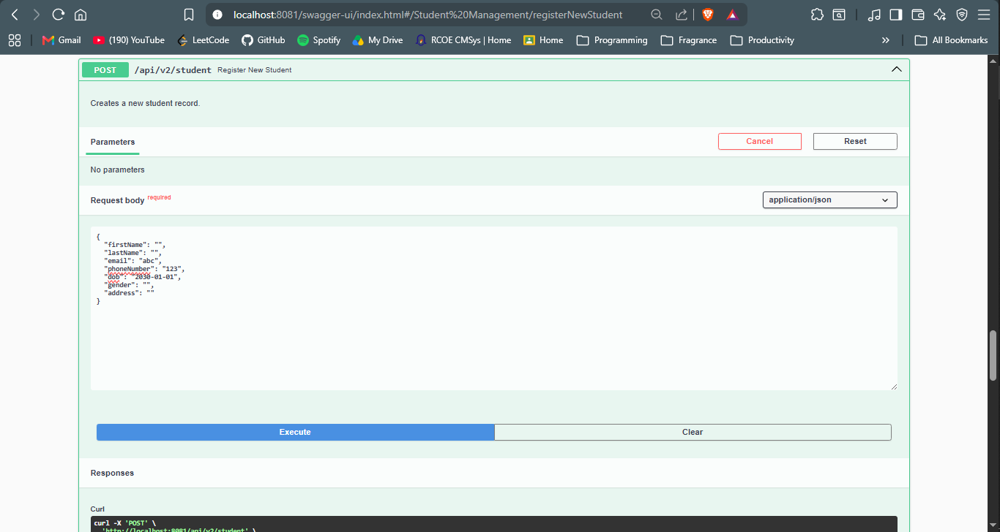

# 🎓 Student Management REST API


A production-style **Student Management REST API** built with **Spring Boot 3** following clean architecture and RESTful design principles.

The project demonstrates CRUD operations, DTO validation, exception handling, pagination, sorting, dynamic filtering using JPA Specifications, PostgreSQL integration, and interactive API documentation with Swagger UI.


---
## ⭐ Highlights

- Production-style REST API
- Layered architecture
- DTO validation
- Global exception handling
- Dynamic filtering with JPA Specifications
- Interactive Swagger UI
- Dockerized PostgreSQL
---
## 🚀 Features

- ✅ CRUD Operations
- ✅ Layered Architecture (Controller → Service → Repository)
- ✅ DTO Pattern
- ✅ Bean Validation
- ✅ Global Exception Handling
- ✅ Custom Exceptions
- ✅ Pagination
- ✅ Sorting
- ✅ Dynamic Search (JPA Specifications)
- ✅ PostgreSQL Integration
- ✅ Swagger / OpenAPI Documentation
- ✅ Docker Compose for PostgreSQL

---

## 🛠 Tech Stack

| Technology | Version |
|------------|---------|
| Java | 21 |
| Spring Boot | 3.x |
| Spring Data JPA | ✓ |
| PostgreSQL | 16 |
| Maven | ✓ |
| Swagger (OpenAPI 3) | springdoc-openapi |
| Docker Compose | ✓ |

---

## 📂 Project Structure

```
src
├── main
│   ├── java
│   │   └── com.abdulrehman.studentapi
│   │       ├── config
│   │       ├── exception
│   │       └── student
│   │           ├── dto
│   │           ├── specification
│   │           ├── Student
│   │           ├── StudentController
│   │           ├── StudentRepository
│   │           ├── StudentService
│   │           └── StudentConfig
│   └── resources
│       └── application.properties
└── test
```

---

## ⚙️ Getting Started

### Clone the repository

```bash
git clone https://github.com/AbdulRehmanChoudhry/student-management-api.git

cd student-management-api
```

---

### Configure PostgreSQL

Update your database credentials inside

```
src/main/resources/application.properties
```

```properties
spring.datasource.url=jdbc:postgresql://localhost:5432/student
spring.datasource.username=your_username
spring.datasource.password=your_password
```

---

### Start PostgreSQL using Docker

```bash
docker compose up -d
```

---

### Run the application

```bash
./mvnw spring-boot:run
```

or

```bash
mvn spring-boot:run
```

---

## 📖 API Documentation

After starting the application, Swagger UI is available at

```
http://localhost:8081/swagger-ui.html
```

OpenAPI specification

```
http://localhost:8081/api-docs
```

---

## 📸 API Preview

### Swagger Dashboard

<p align="center">

</p>

---

### Register Student

<p align="center">

</p>


---

### Retrieve Students

<p align="center">

</p>


---

### Validation Errors

<p align="center">

</p>

### Validation Errors Response

<p align="center">

</p>

---
## Example Request

POST /api/v2/student

{
"firstName": "Abdul",
"lastName": "Choudhry",
"email": "abdul@gmail.com",
"phoneNumber": "9876543210",
"dob": "2004-10-20",
"gender": "Male",
"address": "Mumbai"
}
---

## 📌 Sample Endpoints

| Method | Endpoint | Description |
|---------|----------|-------------|
| GET | `/api/v2/student` | Retrieve students |
| POST | `/api/v2/student` | Register a student |
| PUT | `/api/v2/student/{studentId}` | Update a student |
| DELETE | `/api/v2/student/{studentId}` | Delete a student |

---

## 🏗 Architecture

```
                Client
                   │
                   ▼
            REST Controller
                   │
                   ▼
             Service Layer
                   │
                   ▼
             Repository (JPA)
                   │
                   ▼
               PostgreSQL
```

---

## 👨‍💻 Author

**Abdul Rehman Choudhry**

🌐 Portfolio  
https://portfolio.abdulrehmanchoudhry.tech/

💼 LinkedIn  
https://www.linkedin.com/in/abdul-rehman-choudhry/
💻 GitHub  
https://github.com/AbdulRehmanChoudhry

---

## 📄 License

This project is licensed under the MIT License.